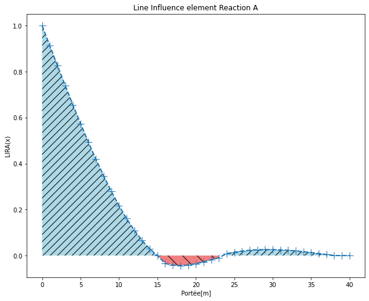
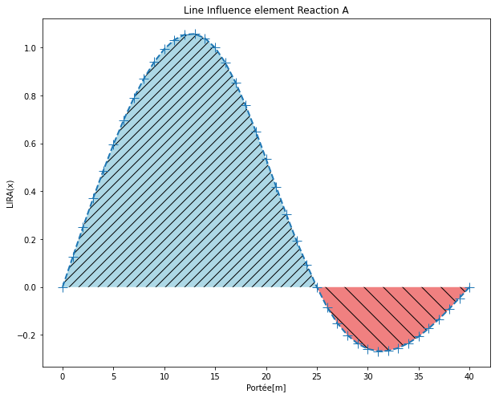
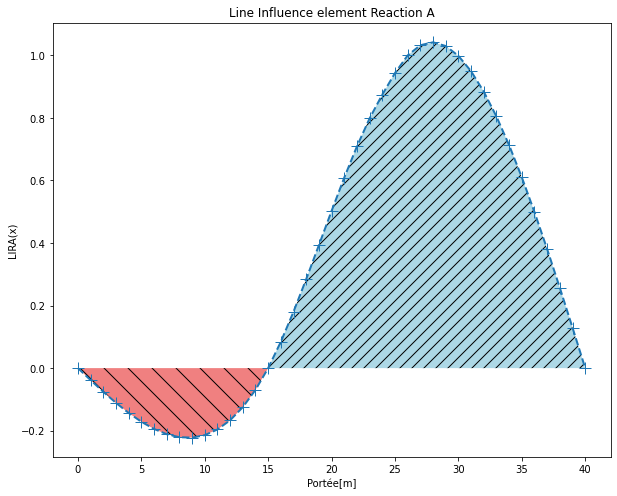
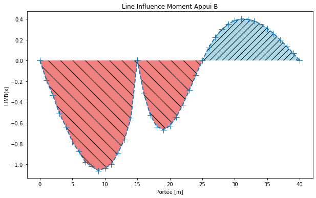
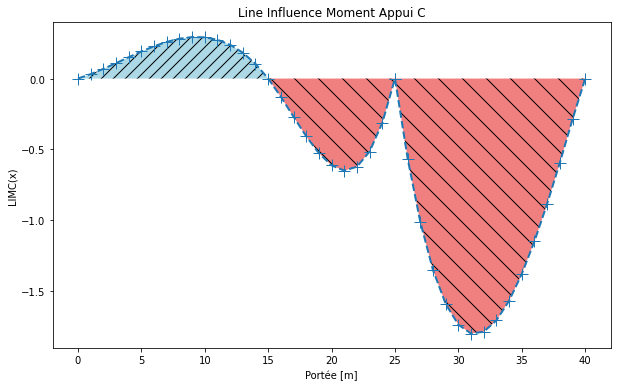
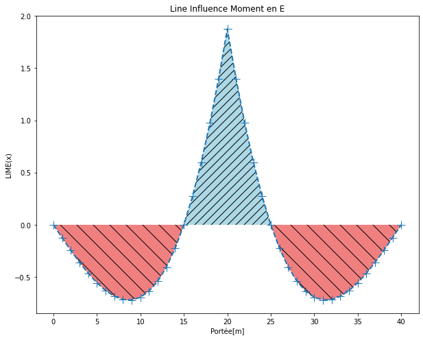
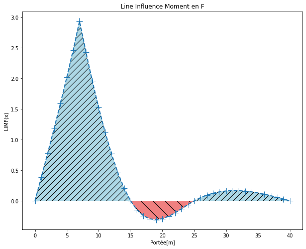
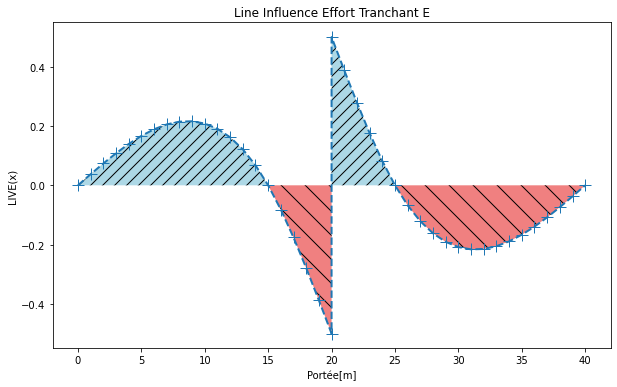
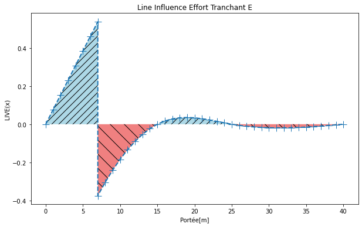

## Ligne d'Influence
Nous présentons le calcul de la ligne d'influence utilisant la méthode du Muller Breslaut.
Le calcul matriciel des déplacements est utilisé.

Les notes de calcul sont visible dans : 
- LIRA détaille le calcul de la ligne d'influence pour la réaction d'appui A. Voir fichier [LIRA.ipynb](LIRA.ipynb): 

- LIRB, ligne d'influence Réaction d'appui B, dans le fichier [LIRB.ipynb](LIRB.ipynb) :

- LIRC, ligne d'influence Reaction d'appui. Voir fichier [LIRC.ipynb](LIRC.ipynb) :

- LIMB détaille le calcul de la ligne
 d'influence pour le moment à l'appui B. Voir fichier [LIMB.ipynb](LIMB.ipynb):

 

- LIMC, ligne d'influence du moment sur appui C. Voir fichier [LIMC.ipynb](LIMC.ipynb) :

 

- LIME détaille le calcul de la ligne d'influence pour le moment interne en E. Voir fichier [LIME.ipynb](LIME.ipynb):

- LIMF ligne d'influence moment en F, (milieu du seguement de poutre AB). Voir fichier [LIMF](LIMF.ipynb):

- LIVE détaille le calcul de la ligne d'influence pour l'éffort tranchant en E. Voir fichier [LIVE](LIVE.ipynb):

- LIVF, ligne d'influence effort tranchant au point F (milieu de la portion de poutre (AB)). Voir fichier [LIVF](LIVF.ipynb):

Les resultats des lignes d'influence sont à consulter dans le dosser ./resultat

