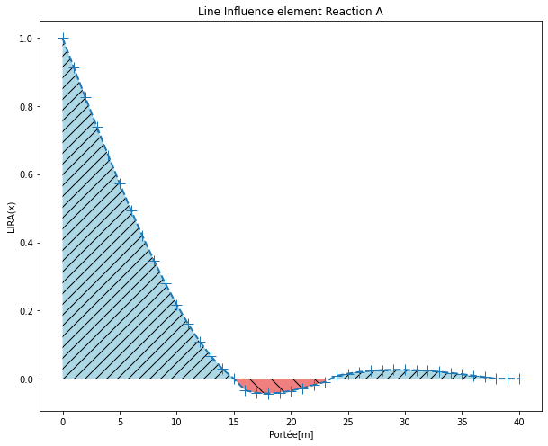
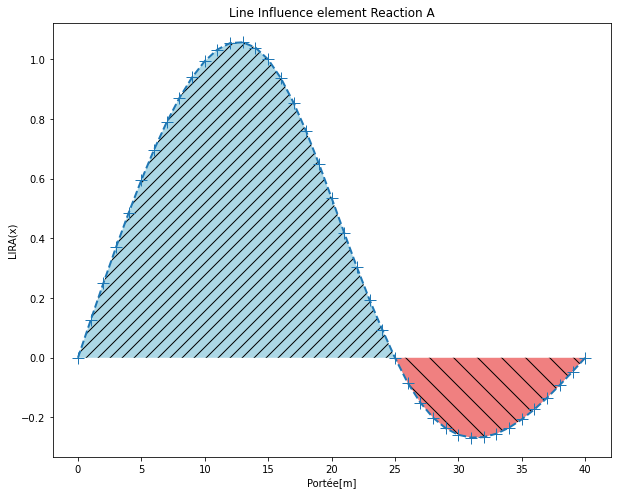
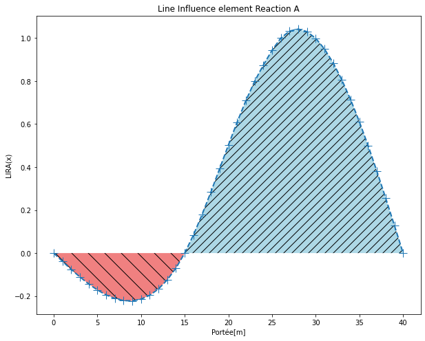
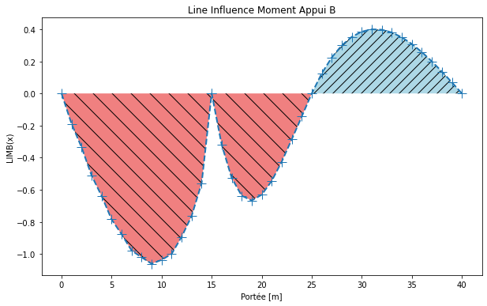
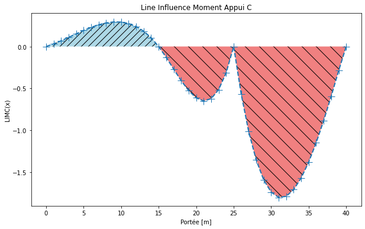
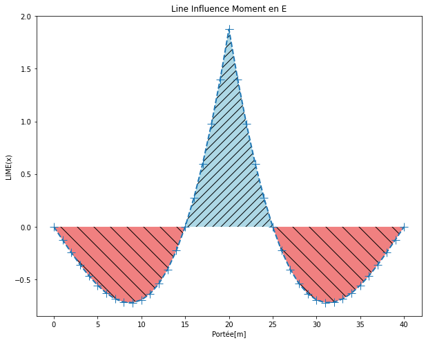
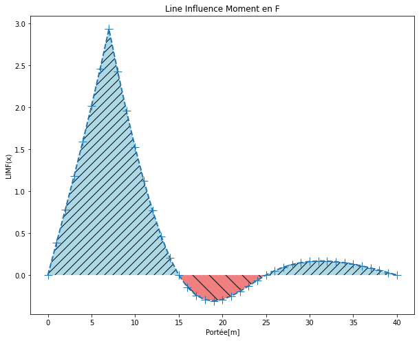
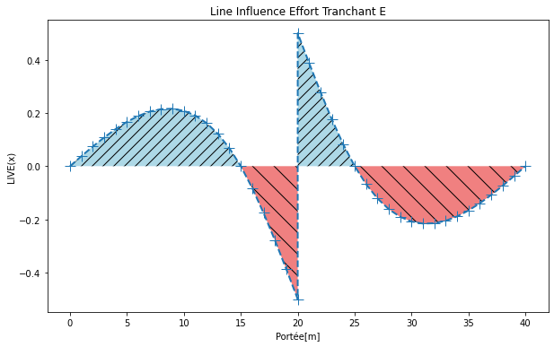
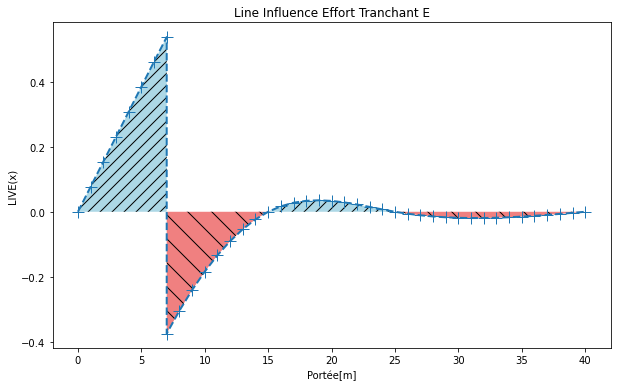

# Ponts à poutres — lignes d'influence & sollicitations de superstructure

Calcul des **lignes d'influence** d'une poutre continue par la méthode de
**Müller-Breslau**, mise en œuvre par la **méthode matricielle des déplacements**
(éléments de portique 2D, 3 DDL/nœud), puis application aux sollicitations
**AASHTO LRFD** : charges mobiles **HL-93**, charges permanentes **DC/DW**, et
**dimensionnement de la dalle de tablier** par la méthode de la bande équivalente.

Projet **pédagogique** (cours de pont) en 3 couches :

| Couche | Techno | Rôle |
|---|---|---|
| Moteur | Python + NumPy (`engine/`, `calcul_structure.py`) | tout le calcul, testé |
| Backend | FastAPI + Pydantic (`backend/`) | adaptateur HTTP au-dessus du moteur |
| Frontend | React + TypeScript + Vite (`web/`) | présentation seule, **aucun calcul en TS** |

La documentation de référence (architecture, contrat d'API, règles métier, décisions
rejetées) est dans [docs/](docs/) — c'est la source de vérité du projet.

---

## Installation (Windows) — pour commencer

Deux fichiers à double-cliquer, dans cet ordre. Aucune connaissance technique requise.

| | Fichier | Quand |
|---|---|---|
| 1 | **`INSTALLERMOI.bat`** | **une seule fois**, à la première utilisation |
| 2 | `run.bat` | à chaque fois que vous voulez utiliser l'application |

### 1. `INSTALLERMOI.bat` — installe tout

Double-cliquez dessus et laissez faire (quelques minutes, **connexion internet
nécessaire**). Le script :

1. vérifie que **Python ≥ 3.10** est présent (sinon il propose de l'installer, ou vous
   donne le lien) ;
2. vérifie que **Node.js** est présent (idem — c'est lui qui affiche l'interface) ;
3. crée un environnement Python isolé `.venv/` (rien n'est modifié ailleurs sur votre
   PC) ;
4. installe les dépendances de calcul (`numpy`, `fastapi`, …) ;
5. installe les dépendances de l'interface web (`npm install`) ;
6. vérifie que le moteur répond et lance la suite de tests.

Si un outil manquait et vient d'être installé, le script vous demande de **fermer la
fenêtre et de le relancer** : c'est normal, Windows doit rafraîchir ses variables
d'environnement. En cas d'erreur, le message affiché indique quoi faire.

### 2. `run.bat` — lance l'application

Ouvre deux fenêtres (backend + interface). Ouvrez ensuite dans votre navigateur :

- **http://127.0.0.1:5173** — l'interface ;
- http://127.0.0.1:8000/docs — la documentation interactive de l'API.

Pour arrêter : fermez les deux fenêtres.

### Installation manuelle (autres systèmes, ou si vous préférez la ligne de commande)

```bash
# 1. Moteur + API
python -m venv .venv                     # optionnel mais recommandé
pip install -r requirements.txt
uvicorn backend.main:app --reload        # http://127.0.0.1:8000  (docs : /docs)

# 2. Interface web  (Node.js >= 20)
cd web
npm install
npm run dev                              # http://127.0.0.1:5173
```

L'URL de l'API utilisée par le front est configurable par `VITE_API_BASE`
(défaut `http://127.0.0.1:8000`).

## Utilisation directe (Python)

```python
from engine import compute_influence_line

res = compute_influence_line(spans=[15, 10, 15], quantity="R", target_x=0, dx=1.0)
# res["x"], res["y"], res["y_nodes"], res["normalization"], res["meta"]
```

`quantity` : `"R"` (réaction), `"M"` (moment), `"V"` (effort tranchant). `target_x` doit
tomber sur un nœud (et être un appui pour `"R"`). Le moteur est **agnostique aux unités** :
les ordonnées sortent dans l'unité de longueur fournie.

Autres entrées du moteur : `sweep_effect` (balayage HL-93), `distributed_effect` /
`distributed_envelope` (DC/DW), `deck_design` / `deck_section_study` (tablier).

## Fonctionnalités de l'interface

### Onglet « Poutre longitudinale »
Géométrie partagée (travées, discrétisation `dx`, grandeur, section étudiée), éditeur de
poutre interactif, et deux sous-onglets :

- **Charge mobile HL-93** — camion de calcul (35 / 145 / 145 kN, espacement arrière réglable
  4,3–9,0 m) ou tandem (2 × 110 kN à 1,2 m), majoration dynamique **IM = 33 %**. Essieux
  matérialisés à leur position AASHTO exacte, ligne d'influence live, **position critique**
  trouvée par balayage, et efforts tranchants **avant / après** la coupure rendus séparément.
- **Charges permanentes DC/DW** — effet `w·∫η dx`, chargement alterné (zones η>0 / η<0
  ombrées) et **lignes d'enveloppe** de M et V le long de la poutre.

### Onglet « Tablier (dalle) »
La dalle est traitée comme une **poutre continue transversale** portée par les longerons,
avec le même moteur :

- dimensionnement live par la **bande équivalente AASHTO** (moment positif, moment négatif,
  effort tranchant, porte-à-faux par statique) ;
- décomposition DC (dalle réparti + barrière + glissière, appliquées aux **deux rives**), DW,
  et charge roulante pour **1 / 2 / 3 voies** chargées (facteurs de présence multiple
  éditables), combinaison **Strength I** à facteurs éditables ;
- panneau **« Étude d'une section »** : l'utilisateur choisit une section transversale et
  obtient le **moment et l'effort tranchant** à cet endroit (2 lignes d'influence, roues au
  placement critique, bascule « Roues M / Roues V »).

### Unités
Bascule **SI ↔ US** : les deux jeux de valeurs HL-93 **officiels** de l'AASHTO sont stockés
(jamais convertis numériquement — cf. `docs/05`), ainsi que les deux familles de formules de
bande équivalente.

## Tests

```bash
pytest tests/                # 157 tests — moteur + API
cd web && npm run test       # 19 tests Vitest — contrat typé & helpers
cd web && npm run typecheck  # tsc -b
cd web && npm run lint       # oxlint
```

Sous Windows, après `INSTALLERMOI.bat`, la commande exacte est
`.venv\Scripts\python -m pytest tests/` (le script l'exécute déjà pour vous en fin
d'installation).

Les tests valident des **invariants analytiques exacts** (somme des LI de réaction = 1 en
tout point, LI nulle aux appuis, saut de valeur unitaire pour `V`, saut de pente unitaire
pour `M`, `w·L²/8` à mi-travée, `Mu = Σγ·M`…) et **jamais** les CSV historiques.

> ⚠️ Les CSV de [resultats/](resultats/), issus des anciens notebooks, sont en partie
> **erronés** (matrices `LM` saisies à la main). Le moteur générique corrige ces erreurs ;
> seul `LIVE_resultats.csv` était correct.

---

## Notes de calcul (notebooks pédagogiques)

Les notebooks historiques sont conservés dans [legacy/](legacy/) à titre **pédagogique
uniquement** — ils ne servent plus de moteur de calcul.

- **LIRA** — ligne d'influence de la réaction d'appui A : [legacy/LIRA.ipynb](legacy/LIRA.ipynb)



- **LIRB** — réaction d'appui B : [legacy/LIRB.ipynb](legacy/LIRB.ipynb)



- **LIRC** — réaction d'appui C : [legacy/LIRC.ipynb](legacy/LIRC.ipynb)



- **LIMB** — moment à l'appui B : [legacy/LIMB.ipynb](legacy/LIMB.ipynb)



- **LIMC** — moment sur appui C : [legacy/LIMC.ipynb](legacy/LIMC.ipynb)



- **LIME** — moment interne en E : [legacy/LIME.ipynb](legacy/LIME.ipynb)



- **LIMF** — moment en F (milieu de la travée AB) : [legacy/LIMF.ipynb](legacy/LIMF.ipynb)



- **LIVE** — effort tranchant en E : [legacy/LIVE.ipynb](legacy/LIVE.ipynb)



- **LIVF** — effort tranchant en F (milieu de la travée AB) : [legacy/LIVF.ipynb](legacy/LIVF.ipynb)



Également dans [legacy/](legacy/) : `LIVB.ipynb`, `LIVC.ipynb`, `application.ipynb` et
`application_poutre_continue_discretise.ipynb`.

Convention de nommage `LI<grandeur><point>` : `LIR*` réaction, `LIM*` moment, `LIV*` effort
tranchant ; A/B/C sont des appuis, E/F des points intérieurs.
